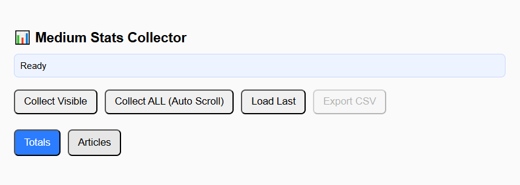
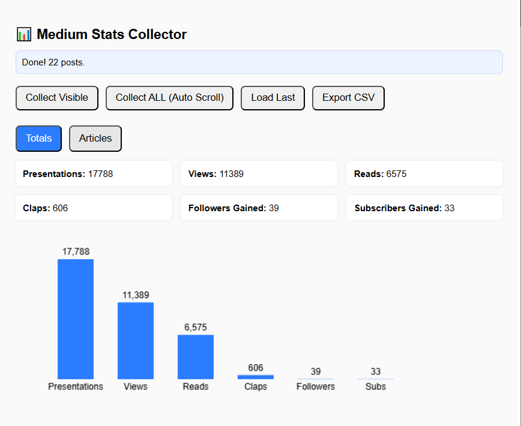
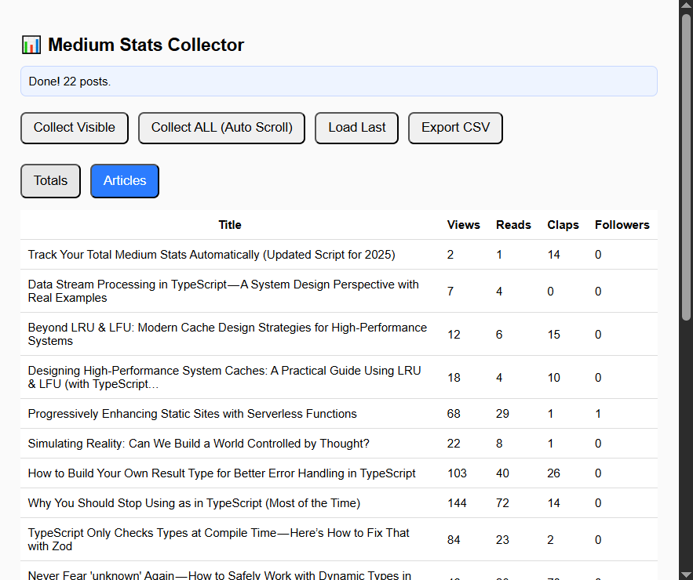

# 🚀 Medium Stats Collector (Chrome Extension)

A powerful, privacy-friendly Chrome Extension that collects **detailed Medium article statistics** using Medium’s
internal GraphQL APIs.
Easily aggregate stats for **views, reads, claps, followers gained, subscribers gained, presentations,** and more — for
**all** your Medium posts.

This extension works directly on your Medium **Stats** dashboard and can auto-scroll to capture **all posts**, no matter
how many you have.

---

## 📸 Screenshots

<p align="center">



</p>

---

## ✨ Features

- **Collect stats for visible posts** or automatically scroll through your entire Medium stats page.
- Fetches detailed metrics via Medium’s internal GraphQL endpoints:
    - Views
    - Reads
    - Presentations
    - Claps
    - Followers Gained
    - Subscribers Gained
    - CTR and other internal metrics
- **Totals tab** with an auto-rendered mini bar chart (pure `<canvas>`, no external libs).
- **Articles tab** with sortable table of per-post stats.
- **CSV Export** for offline analytics.
- Automatically saves last collected data in Chrome storage.
- Works on:
    - `https://medium.com/me/stats`
    - Publication stats pages
    - Individual post stats pages

---

## 🛠️ Installation (Developer Mode)

1. Clone this repository:

    ```bash
    git clone https://github.com/your-user/medium-stats-extension.git
    cd medium-stats-extension
    ```
2. Open Chrome and navigate to:

    ```bash
    chrome://extensions/
    ```
3. Enable **Developer Mode** (top right).
4. Click **Load unpacked** and select this project folder.
5. You should now see the extension in your toolbar.

---

## 📘 How To Use

### 1. Open Medium Stats

Go to:

   ```bash
   https://medium.com/me/stats
   ```

Wait for the posts to load.

### 2. Open the Extension Popup

Click the extension icon → **Medium Stats Collector**.

### 3. Choose an action:

**▶️ Collect Visible**

Fetch stats only for the posts currently loaded on the screen.
Useful if you manually scroll and want partial data.

**▶️ Collect ALL (Auto Scroll)**

Auto-scrolls to the bottom of your stats page and captures all posts automatically.
Works even with hundreds of posts.

**▶️ Load Last**

Reloads previously collected results from Chrome storage.

**▶️ Collect Visible**

Outputs a CSV with all collected stats.

---

## 📂 Project Structure

```text
medium-stats-extension/
│
├── manifest.json        # Chrome Extension MV3 config
├── popup.html           # Extension popup UI
├── popup.js             # UI logic
├── styles.css           # Popup styling
│
├── background.js        # Main GraphQL collector (MV3 service worker)
├── content.js           # Stats page scanner
├── contentScript.js     # Auto-scrolling collector (paginated)
│
└── README.md            # This file
```

---

## 🔧 Technical Overview

### ⚙️ Background Service Worker (background.js)

- Handles GraphQL batching (10 posts per request).
- Uses Medium’s internal `postStatsTotalBundle` + `postResult` to gather full metrics.
- Normalizes and aggregates stats.
- Stores results in `chrome.storage.local`.

### 🖥️ Popup Application

- Renders stats in two modes:
    - **Totals** (with a mini bar chart)
    - **Articles** table
- Triggers collection logic.
- Exports CSV.

### 🌐 Content Scripts

- Scans Medium stats pages for post anchors.
- Extracts article IDs, titles, URLs.
- Supports:
    - Direct scan of visible posts.
    - Full-page auto-scroll scraping.

---

## 📊 Data Collected

For each article:

| Metric                | Description                     |
|-----------------------|---------------------------------|
| **views**             | ViewersCount                    |
| **reads**             | ReadersCount                    |
| **presentations**     | Feed presentation count         |
| **claps**             | Clap count                      |
| **followersGained**   | Follows gained from the article |
| **subscribersGained** | Email subscribers gained        |
| **CTR**               | feedClickThroughRate            |

> [!IMPORTANT]
> No personal tokens, passwords, or private content is collected.

---

## 🔒 Privacy

- All data is processed **locally in your browser**.
- Stats are retrieved using your existing Medium session cookies.
- No analytics, tracking, or external logging.
- No data leaves your machine.

---

## ⚠️ Disclaimer

This extension uses **Medium's internal GraphQL API**, which is undocumented and may change at any time.
If Medium updates their internal endpoints, the extension may require an update.

---

## 📝 License

[MIT License](LICENSE) — free to modify, distribute, and use.

---

## 💬 Feedback & Contributions

Pull requests and issues are welcome!
If you have ideas, improvements, or encounter API changes, feel free to open an issue.
