# 📐 API Reference Diagrams

### Message Flow Overview

**Extension-wide communication diagram**

---

### Background Service Worker Architecture

---

### GraphQL Request Lifecycle

---

### Content Script Flow (Visible Scan)

```mermaid
flowchart TD

    A[content.js loaded] --> B["waitForLinks()"]
    B -->|anchors found| C[extract href + title]
    C --> D["extractPostIdFromHref()"]
    D --> E["Send posts → background.collectStatsForPosts"]

    E --> F[Listen for popup.collectNow]
    F --> G["gatherAndSend()"]
    G --> E
```

---

### Auto-Pagination Collector Flow (Injected Script)

---

### Popup UI Rendering Lifecycle

---

### Extension Architecture Map

---

### Data Model Diagram

---

### Message API Reference Diagram (Extension RPC System)

